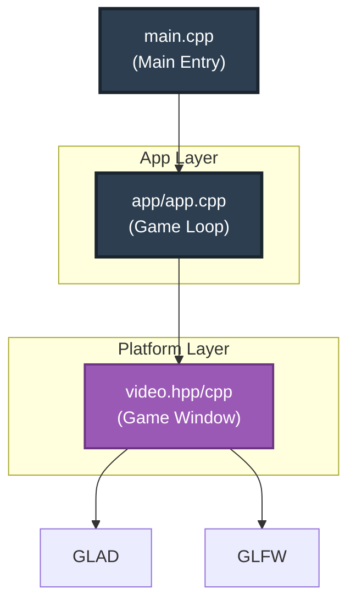

```mermaid
graph TB
main["main.cpp<br/>(Main Entry)"]

subgraph App ["App Layer"]
    app["app/app.cpp<br/>(Game Loop)"]
end

subgraph Platform ["Platform Layer"]
    video["video.hpp/cpp<br/>(Game Window)"]
end

%% Main dependencies
main --> app

%% App Layer dependencies
app --> video

%% Platform Layer dependencies
video --> GLAD
video --> GLFW

classDef mainClass fill:#2c3e50,stroke:#1a252f,stroke-width:3px,color:#fff
classDef platformClass fill:#9b59b6,stroke:#6c3483,stroke-width:2px,color:#fff

class main,app mainClass
class video platformClass
```
